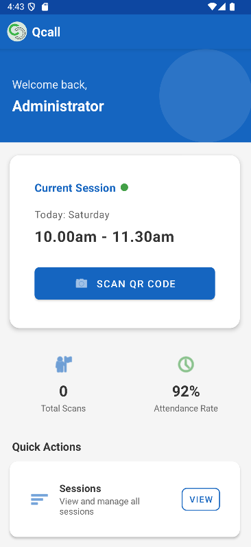
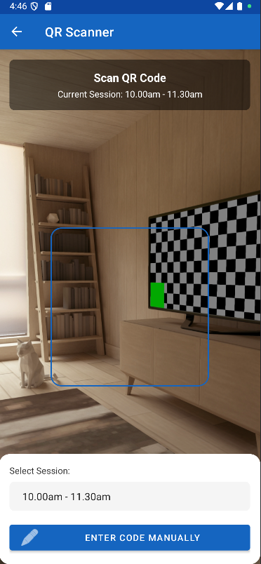

# QCall - Attendance Tracking Application

QCall is a modern, user-friendly Android application designed for efficiently managing and tracking attendance through QR code scanning. It provides an intuitive interface for administrators to monitor sessions, track attendance rates, and manage participant information.

## Features

- **QR Code Scanning**: Quickly verify attendance by scanning participant QR codes
- **Session Management**: View and manage all available sessions
- **Real-time Attendance Tracking**: Track attendance rates and total scans
- **Recent Activity Log**: Monitor recent scan history with clear status indicators
- **Offline Support**: Continue operations even with limited connectivity
- **Professional UI/UX**: Clean, intuitive interface designed for efficiency

## Screenshots

<table>
  <tr>
    <td></td>
    <td></td>
    <td></td>
  </tr>
</table>

## Architecture

QCall follows the MVVM (Model-View-ViewModel) architecture pattern for a clean separation of concerns:

- **Model**: Data classes and repositories to handle business logic and data operations
- **View**: Fragment-based UI components with modern Material Design
- **ViewModel**: Manages UI-related data and handles business logic

## Technical Specifications

- **Language**: Kotlin
- **Min SDK**: 21 (Android 5.0 Lollipop)
- **Target SDK**: 34 (Android 14)
- **Architecture**: MVVM with LiveData and ViewModels
- **UI Components**: Material Design Components, ConstraintLayout
- **Navigation**: Jetpack Navigation Component with animations
- **QR Scanning**: ML Kit or ZXing for QR code processing
- **Persistence**: Room Database for local storage

## Project Structure

```
app/
├── src/
│   ├── main/
│   │   ├── java/com/example/attendanceapp/
│   │   │   ├── adapters/        # RecyclerView adapters
│   │   │   ├── models/          # Data models
│   │   │   ├── repositories/    # Data repositories
│   │   │   ├── ui/              # Activities and Fragments
│   │   │   │   ├── HomeFragment.kt
│   │   │   │   ├── ScannerFragment.kt
│   │   │   │   ├── SessionListFragment.kt
│   │   │   │   └── VerificationResultFragment.kt
│   │   │   ├── utils/           # Utility classes
│   │   │   └── viewmodel/       # ViewModels
│   │   │       └── AttendanceViewModel.kt
│   │   ├── res/
│   │   │   ├── drawable/        # Icons and graphics
│   │   │   ├── layout/          # XML layouts
│   │   │   ├── navigation/      # Navigation graphs
│   │   │   └── values/          # Colors, strings, styles
│   │   └── AndroidManifest.xml
│   └── test/                    # Unit and instrumentation tests
└── build.gradle
```

## Setup & Installation

1. Clone the repository:
   ```
   git clone https://github.com/CardenDante/AttendanceApp.git
   ```

2. Open the project in Android Studio Arctic Fox (2021.3.1) or later.

3. Ensure you have the latest Android SDK and build tools installed.

4. Sync the Gradle files and build the project.

5. Run the application on an emulator or physical device.

## Dependencies

```gradle
dependencies {
    // Core Android dependencies
    implementation "androidx.core:core-ktx:1.12.0"
    implementation "androidx.appcompat:appcompat:1.6.1"
    implementation "com.google.android.material:material:1.10.0"
    implementation "androidx.constraintlayout:constraintlayout:2.1.4"
    
    // Lifecycle components
    implementation "androidx.lifecycle:lifecycle-viewmodel-ktx:2.6.2"
    implementation "androidx.lifecycle:lifecycle-livedata-ktx:2.6.2"
    
    // Navigation components
    implementation "androidx.navigation:navigation-fragment-ktx:2.7.4"
    implementation "androidx.navigation:navigation-ui-ktx:2.7.4"
    
    // QR code scanning
    implementation "com.google.mlkit:barcode-scanning:17.2.0"
    // or
    implementation "com.journeyapps:zxing-android-embedded:4.3.0"
    
    // Room for local database
    implementation "androidx.room:room-runtime:2.6.0"
    kapt "androidx.room:room-compiler:2.6.0"
    implementation "androidx.room:room-ktx:2.6.0"
    
    // Testing
    testImplementation "junit:junit:4.13.2"
    androidTestImplementation "androidx.test.ext:junit:1.1.5"
    androidTestImplementation "androidx.test.espresso:espresso-core:3.5.1"
}
```

## Configuration

### QR Code Format

The application expects QR codes in the following JSON format:
```json
{
  "id": "A12345",
  "name": "John Doe",
  "session_id": "S789"
}
```

### Custom Styling

The application uses a custom theme based on Material Design components. Main colors can be easily adjusted in the `colors.xml` file:

```xml
<!-- Primary brand colors -->
<color name="primary">#1565C0</color>
<color name="primary_dark">#0D47A1</color>
<color name="primary_light">#42A5F5</color>

<!-- Secondary & accent colors -->
<color name="secondary">#43A047</color>
<color name="secondary_dark">#2E7D32</color>
<color name="secondary_light">#66BB6A</color>
```

## Usage Guide

### Scanning Attendance

1. From the Home screen, tap the "SCAN QR CODE" button
2. Point your camera at the participant's QR code
3. The app will verify the participant and display their information
4. Tap "DONE" to return to Home or "SCAN ANOTHER" to continue scanning

### Viewing Sessions

1. From the Home screen, tap "View" in the Quick Actions section
2. Browse the list of available sessions
3. Tap on a session to view its details and attendance information

### Clearing Scan History

1. From the Home screen, tap "Clear" in the Recent Activity section
2. Confirm the action to clear all scan history

## License

This project is licensed under the MIT License - see the LICENSE file for details.

## Contributors

- Daniel Chacha - Initial work and maintenance

## Acknowledgments

- Icons provided by [Material Design Icons](https://material.io/resources/icons/)
- QR code scanning functionality powered by [ML Kit](https://developers.google.com/ml-kit/vision/barcode-scanning) / [ZXing](https://github.com/zxing/zxing)

## Contact

For questions or support, please contact: chach-a.com/contact